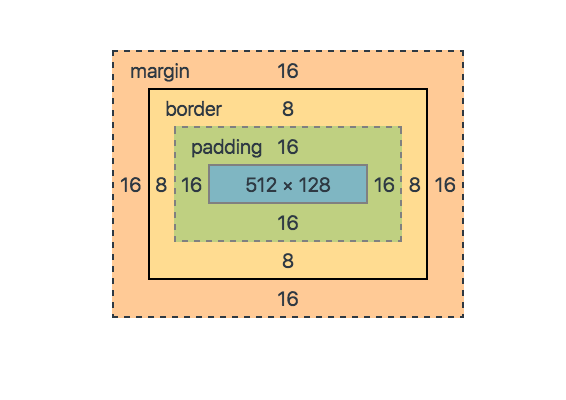

# CSS Basics

## Table Of Contents

1. <a href="#add-css">Add CSS</a>
2. <a href="#color">Color</a>
3. <a href="#background">Background</a>
4. <a href="#border">Border</a>
5. <a href="#margin">Margin</a>
6. <a href="#padding">Padding</a>
7. <a href="#width">Width</a>
8. <a href="#height">Height</a>
9. <a href="#box-model">Box Model</a>
10. <a href="#outline">Outline</a>
11. <a href="#text">Text</a>
12. <a href="#fonts">Fonts</a>
13. <a href="#links">Links</a>
14. <a href="#list">List</a>
15. <a href="#display">Display</a>
16. <a href="#max-width">Max-Width</a>
17. <a href="#position">Position</a>
18. <a href="#z-index">Z-Index</a>
19. <a href="#overflow">Overflow</a>
20. <a href="#float">Float</a>
21. <a href="#css-combinators">CSS Combinators</a>
22. <a href="#pseudo-classes">Pseudo-classes</a>
23. <a href="#pseudo-elements">Pseudo-elements</a>
24. <a href="#opacity">Opacity</a>
25. <a href="#css-attribute-selector">CSS [attribute] Selector</a>
26. <a href="#counter">Counter</a>
27. <a href="#units">Units</a>
28. <a href="#css-specificity">CSS Specificity</a>
29. <a href="#math-functions">Math Functions</a>

# Add CSS

```html
<!DOCTYPE html>
<html lang="en">
  <head>
    <title>Document</title>
    <!-- External CSS -->
    <link rel="stylesheet" href="./style.css" />
    <!-- Internal CSS -->
    <style>
      h1 {
        color: blue;
      }
    </style>
  </head>

  <body>
    <h1>External CSS</h1>
    <!-- Inline CSS -->
    <h2 style="color: red">Inline CSS</h2>
  </body>
</html>
```

# Color

<code>
color: color|initial|inherit;
</code>

```css
h1 {
  color: tomato;
  /* color rgb(red, green, blue)*/
  color: rgb(255, 99, 71);
  /* color rgba(red, green, blue, alpha) */
  /* The alpha parameter is a number between 0.0 (fully transparent) and 1.0 (not transparent at all): */
  color: rgb(255, 99, 71, 0);
  color: rgb(255, 99, 71, 0.5);
  color: rgb(255, 99, 71, 1);
  /* color hex #rrggbb #rgb */
  color: #ff6347;
  color: #f64;
  /* color hsl(hue, saturation, lightness) */
  color: hsl(0, 100%, 50%);
  /* color hsla(hue, saturation, lightness, alpha) */
  color: hsl(0, 100%, 50%, 0.5);
}
```

# Background

<code>
    background-color: color|transparent|initial|inherit;
</code>

```css
div {
  background-color: red;
  background-color: #bbff00;
  background-color: rgb(255, 255, 128);
  background-color: hsl(50, 33%, 25%);
  background-color: currentColor;
  background-color: transparent;
}
```

<code>
    background-image: url|none|initial|inherit;
</code>

```css
div {
  background-image: url("paper.gif");
  background-image: url(image1.png), url(image2.png), url(image3.png),
    url(image4.png);
  background-image: linear-gradient(to bottom, red, blue), url("catfront.png");
}
```

<code>
    background-repeat: repeat|repeat-x|repeat-y|no-repeat|initial|inherit;
</code>

```css
div {
  /* Keyword values */
  background-repeat: repeat-x;
  background-repeat: repeat-y;
  background-repeat: repeat;
  background-repeat: space;
  background-repeat: round;
  background-repeat: no-repeat;

  /* Two-value syntax: horizontal | vertical */
  background-repeat: repeat space;
  background-repeat: repeat repeat;
  background-repeat: round space;
  background-repeat: no-repeat round;
}
```

<code>
    background-size: auto|length|cover|contain|initial|inherit;
</code>

```css
div {
  /* Keyword values */
  background-size: cover;
  background-size: contain;

  /* One-value syntax */
  /* the width of the image (height becomes 'auto') */
  background-size: 50%;
  background-size: 3.2em;
  background-size: 12px;
  background-size: auto;

  /* Two-value syntax */
  /* first value: width of the image, second value: height */
  background-size: 50% auto;
  background-size: 3em 25%;
  background-size: auto 6px;
  background-size: auto auto;

  /* Multiple backgrounds */
  background-size: auto, auto; /* Not to be confused with `auto auto` */
  background-size: 50%, 25%, 25%;
  background-size: 6px, auto, contain;
}
```

<code>
   background-position: value;
</code>

```css
div {
  /* Keyword values */
  background-position: top;
  background-position: bottom;
  background-position: left;
  background-position: right;
  background-position: center;

  /* <percentage> values */
  background-position: 25% 75%;

  /* <length> values */
  background-position: 0 0;
  background-position: 1cm 2cm;
  background-position: 10ch 8em;

  /* Multiple images */
  background-position: 0 0, center;

  /* Edge offsets values */
  background-position: bottom 10px right 20px;
  background-position: right 3em bottom 10px;
  background-position: bottom 10px right;
  background-position: top right 10px;
}
```

<code>
   background-attachment: scroll|fixed|local|initial|inherit;
</code>

```css
div {
  /* Keyword values */
  background-attachment: scroll;
  background-attachment: fixed;
  background-attachment: local;
}
```

<code>
   background-clip: border-box|padding-box|content-box|initial|inherit;
</code>

````css
div {
 /* Keyword values */
  background-clip: border-box;
  background-clip: padding-box;
  background-clip: content-box;
  background-clip: text;
}

<code>
   background-origin: padding-box|border-box|content-box|initial|inherit;
</code>

```css
div {
   /* Keyword values */
  background-origin: border-box;
  background-origin: padding-box;
  background-origin: content-box;
}
````

<code>
   background-blend-mode: normal|multiply|screen|overlay|darken|lighten|color-dodge|saturation|color|luminosity;
</code>

```css
div {
  /* Keyword values */
  background-blend-mode: multiply;
}
```

<code>
   background: bg-color bg-image position/bg-size bg-repeat bg-origin bg-clip bg-attachment initial|inherit;
</code>

```css
div {
  background-color: #ffffff;
  background-image: url("img_tree.png");
  background-repeat: no-repeat;
  background-position: right top;
  /* shortland */
  background: #ffffff url("img_tree.png") no-repeat right top;
}
```

# Border

<code>
border: border-width border-style border-color|initial|inherit;
</code>

```css
div {
  border: 5px solid red;
}
```

<code>
border-width: medium|thin|thick|length|initial|inherit;
</code>

```css
div {
  border-width: 1px;
  border-width: medium;
  border-width: thick;
  border-width: 25px 10px 4px 35px; /* 25px top, 10px right, 4px bottom and 35px left */

  border-top-width: 1px;
  border-right-width: 10px;
  border-bottom-width: 7px;
  border-left-width: 3px;
}
```

<code>
border-style: none|hidden|dotted|dashed|solid|double|groove|ridge|inset|outset|initial|inherit;
</code>

```css
div {
  border-style: dotted;
  border-style: dashed;
  border-style: solid;
  border-style: double;
  border-style: groove;
  border-style: ridge;
  border-style: inset;
  border-style: outset;
  border-style: none;
  border-style: hidden;

  border-top-style: dotted;
  border-right-style: solid;
  border-bottom-style: dotted;
  border-left-style: solid;
}
```

<code>
border-color: color|transparent|initial|inherit;
</code>

```css
div {
  border-color: royalblue;
  border-color: red green blue yellow; /* red top, green right, blue bottom and yellow left */

  border-top-color: red;
  border-right-color: blue;
  border-bottom-color: yellow;
  border-left-color: red;
}
```

<code>
border-radius: 1-4 length|% / 1-4 length|%|initial|inherit;
</code>

```css
div {
  border-radius: 4px;

  border-top-right-radius: 5px;
  border-bottom-right-radius: 5px;
  border-bottom-left-radius: 5px;
  border-top-left-radius: 5px;
}
```

<code>
border-collapse: separate|collapse|initial|inherit;
</code>

```css
table {
  border-collapse: separate;
  border-collapse: collapse;
}
```

<code>
border-spacing: length|initial|inherit;
</code>

```css
table {
  border-spacing: 15px;
  border-spacing: 15px 50px;
}
```

# Margin

<code>
margin: length|auto|initial|inherit;
</code>

```css
div {
  margin: 100px;
  margin: auto;
  /* 
    top and bottom margins are 25px
    right and left margins are 50px
 */
  margin: 25px 50px;
  /* 
    top margin is 25px
    right and left margins are 50px
    bottom margin is 75px 
  */
  margin: 25px 50px 75px;
  /* 
    top margin is 25px
    right margin is 50px
    bottom margin is 75px
    left margin is 100px
  */
  margin: 20px 0 0 0;

  margin-top: 100px;
  margin-bottom: 100px;
  margin-right: 150px;
  margin-left: 80px;
}
```

# Padding

<code>
padding: length|initial|inherit;
</code>

```css
div {
  padding: 25px;
  /* 
        top and bottom paddings are 25px
        right and left paddings are 50px
    */
  padding: 25px 50px;
  /* 
        top padding is 25px
        right and left paddings are 50px
        bottom padding is 75px
    */
  padding: 25px 50px 75px;
  /* 
        top padding is 25px
        right padding is 50px
        bottom padding is 75px
        left padding is 100px
    */
  padding: 25px 50px 75px 100px;

  padding-top: 50px;
  padding-right: 30px;
  padding-bottom: 50px;
  padding-left: 80px;
}
```

# Width

<code>
width: auto|value|initial|inherit;
</code>

```css
div {
  /* <length> values */
  width: 300px;
  width: 25em;

  /* <percentage> value */
  width: 75%;

  /* Keyword values */
  width: max-content;
  width: min-content;
  width: fit-content(20em);
  width: auto;
}
```

# height

<code>
height: auto|length|initial|inherit;
</code>

```css
div {
  /* <length> values */
  height: 120px;
  height: 10em;
  height: 100vh;

  /* <percentage> value */
  height: 75%;

  /* Keyword values */
  height: max-content;
  height: min-content;
  height: fit-content(20em);
  height: auto;
}
```

# Box Model



# Outline

<code>
outline: outline-width outline-style outline-color|initial|inherit;
</code>

```css
div {
  outline: 1px solid red;
}
```

<code>
outline-width: medium|thin|thick|length|initial|inherit;
</code>

```css
div {
  outline-width: thick;
}
```

<code>
outline-style: none|hidden|dotted|dashed|solid|double|groove|ridge|inset|outset|initial|inherit;
</code>

```css
div {
  outline-style: dotted;
}
```

<code>
outline-color: invert|color|initial|inherit;
</code>

```css
div {
  outline-color: coral;
}
```

<code>
outline-offset: length|initial|inherit;
</code>

```css
div {
  outline: 4px solid red;
  outline-offset: 15px;
}
```

# Text

## Text Alignment

<code>
text-align: left|right|center|justify|initial|inherit;
</code>

```css
div {
  /* Keyword values */
  text-align: start;
  text-align: end;
  text-align: left;
  text-align: right;
  text-align: center;
  text-align: justify;
  text-align: justify-all;
  text-align: match-parent;

  /* Character-based alignment in a table column */
  text-align: ".";
  text-align: "." center;

  /* Block alignment values (Non-standard syntax) */
  text-align: -moz-center;
  text-align: -webkit-center;
}
```

<code>
text-align-last: auto|left|right|center|justify|start|end|initial|inherit;
</code>

```css
div {
  /* Keyword values */
  text-align-last: auto;
  text-align-last: start;
  text-align-last: end;
  text-align-last: left;
  text-align-last: right;
  text-align-last: center;
  text-align-last: justify;
}
```

<code>
direction: ltr|rtl|initial|inherit;
</code>

```css
div {
  /* Keyword values */
  direction: ltr;
  direction: rtl;
}
```

<code>
unicode-bidi: normal|embed|bidi-override|initial|inherit;
</code>

```css
div {
  direction: rtl;
  /* Keyword values */
  unicode-bidi: normal;
  unicode-bidi: embed;
  unicode-bidi: isolate;
  unicode-bidi: bidi-override;
  unicode-bidi: isolate-override;
  unicode-bidi: plaintext;
}
```

<code>
vertical-align: baseline|length|sub|super|top|text-top|middle|bottom|text-bottom|initial|inherit;
</code>

```css
div {
  /* Keyword values */
  vertical-align: baseline;
  vertical-align: sub;
  vertical-align: super;
  vertical-align: text-top;
  vertical-align: text-bottom;
  vertical-align: middle;
  vertical-align: top;
  vertical-align: bottom;

  /* <length> values */
  vertical-align: 10em;
  vertical-align: 4px;

  /* <percentage> values */
  vertical-align: 20%;
}
```

## Text Decoration

<code>
text-decoration-line: none|underline|overline|line-through|initial|inherit;
</code>

```css
div {
  /* Single keyword */
  text-decoration-line: none;
  text-decoration-line: underline;
  text-decoration-line: overline;
  text-decoration-line: line-through;
  text-decoration-line: blink;

  /* Multiple keywords */
  text-decoration-line: underline overline; /* Two decoration lines */
  text-decoration-line: overline underline line-through; /* Multiple decoration lines */
}
```

<code>
text-decoration-color: color|initial|inherit;
</code>

```css
div {
  /* <color> values */
  text-decoration-color: currentcolor;
  text-decoration-color: red;
  text-decoration-color: #00ff00;
  text-decoration-color: rgba(255, 128, 128, 0.5);
  text-decoration-color: transparent;
}
```

<code>
text-decoration-style: solid|double|dotted|dashed|wavy|initial|inherit;
</code>

```css
div {
  /* Keyword values */
  text-decoration-style: solid;
  text-decoration-style: double;
  text-decoration-style: dotted;
  text-decoration-style: dashed;
  text-decoration-style: wavy;
}
```

<code>
text-decoration-thickness: auto|from-font|length/percentage|initial|inherit;
</code>

```css
div {
  /* Single keyword */
  text-decoration-thickness: auto;
  text-decoration-thickness: from-font;

  /* length */
  text-decoration-thickness: 0.1em;
  text-decoration-thickness: 3px;

  /* percentage */
  text-decoration-thickness: 10%;
}
```

<code>
text-decoration: text-decoration-line text-decoration-color text-decoration-style text-decoration-thickness|initial|inherit;
</code>

```css
div {
  text-decoration: underline overline dotted red;
}
```

## Text Transformation

<code>
text-transform: none|capitalize|uppercase|lowercase|initial|inherit;
</code>

```css
div {
  /* Keyword values */
  text-transform: none;
  text-transform: capitalize;
  text-transform: uppercase;
  text-transform: lowercase;
  text-transform: full-width;
  text-transform: full-size-kana;
}
```

## Text Spacing

<code>
text-indent: length|initial|inherit;
</code>

```css
div {
  /* <length> values */
  text-indent: 3mm;
  text-indent: 40px;

  /* <percentage> value
   relative to the containing block width */
  text-indent: 15%;

  /* Keyword values */
  text-indent: 5em each-line;
  text-indent: 5em hanging;
  text-indent: 5em hanging each-line;
}
```

<code>
letter-spacing: normal|length|initial|inherit;
</code>

```css
div {
  /* Keyword value */
  letter-spacing: normal;

  /* <length> values */
  letter-spacing: 0.3em;
  letter-spacing: 3px;
  letter-spacing: 0.3px;
}
```

<code>
line-height: normal|number|length|initial|inherit;
</code>

```css
div {
  /* Keyword value */
  line-height: normal;

  /* Unitless values: use this number multiplied
by the element's font size */
  line-height: 3.5;

  /* <length> values */
  line-height: 3em;

  /* <percentage> values */
  line-height: 34%;
}
```

<code>
word-spacing: normal|length|initial|inherit;
</code>

```css
div {
  /* Keyword value */
  word-spacing: normal;

  /* <length> values */
  word-spacing: 3px;
  word-spacing: 0.3em;

  /* <percentage> values */
  word-spacing: 50%;
  word-spacing: 200%;
}
```

<code>
white-space: normal|nowrap|pre|pre-line|pre-wrap|initial|inherit;
</code>

```css
div {
  /* Keyword values */
  white-space: normal;
  white-space: nowrap;
  white-space: pre;
  white-space: pre-wrap;
  white-space: pre-line;
  white-space: break-spaces;
}
```

## Text Shadow

<code>
text-shadow: h-shadow v-shadow blur-radius color|none|initial|inherit;
</code>

```css
div {
  /* offset-x | offset-y | blur-radius | color */
  text-shadow: 1px 1px 2px black;

  /* color | offset-x | offset-y | blur-radius */
  text-shadow: #fc0 1px 0 10px;

  /* offset-x | offset-y | color */
  text-shadow: 5px 5px #558abb;

  /* color | offset-x | offset-y */
  text-shadow: white 2px 5px;

  /* offset-x | offset-y
/* Use defaults for color and blur-radius */
  text-shadow: 5px 10px;
}
```

# Fonts

<code>
font-family: family-name|generic-family|initial|inherit;
</code>

```css
div {
  /* A font family name and a generic family name */
  font-family: "Gill Sans Extrabold", sans-serif;
  font-family: "Goudy Bookletter 1911", sans-serif;

  /* A generic family name only */
  font-family: serif;
  font-family: sans-serif;
  font-family: monospace;
  font-family: cursive;
  font-family: fantasy;
  font-family: system-ui;
  font-family: ui-serif;
  font-family: ui-sans-serif;
  font-family: ui-monospace;
  font-family: ui-rounded;
  font-family: emoji;
  font-family: math;
  font-family: fangsong;
}
```

<code>
font-style: normal|italic|oblique|initial|inherit;
</code>

```css
div {
  font-style: normal;
  font-style: italic;
  font-style: oblique;
  font-style: oblique 10deg;
}
```

<code>
font-weight: normal|bold|bolder|lighter|number|initial|inherit;
</code>

```css
div {
  /* Keyword values */
  font-weight: normal;
  font-weight: bold;

  /* Keyword values relative to the parent */
  font-weight: lighter;
  font-weight: bolder;

  /* Numeric keyword values */
  font-weight: 100;
  font-weight: 200;
  font-weight: 300;
  font-weight: 400; /* normal */
  font-weight: 500;
  font-weight: 600;
  font-weight: 700; /* bold */
  font-weight: 800;
  font-weight: 900;
}
```

<code>
font-variant: normal|small-caps|initial|inherit;
</code>

```css
div {
  font-variant: small-caps;
  font-variant: common-ligatures small-caps;
}
```

<code>
font-size:medium|xx-small|x-small|small|large|x-large|xx-large|smaller|larger|length|initial|inherit;
</code>

pixels/16=em

1vw = 1% of viewport width.

```css
div {
  /* <absolute-size> values */
  font-size: xx-small;
  font-size: x-small;
  font-size: small;
  font-size: medium;
  font-size: large;
  font-size: x-large;
  font-size: xx-large;
  font-size: xxx-large;

  /* <relative-size> values */
  font-size: smaller;
  font-size: larger;

  /* <length> values */
  font-size: 12px;
  font-size: 0.8em;

  /* <percentage> values */
  font-size: 80%;

  /* math value */
  font-size: math;
}
```

<code>
font: font-style font-variant font-weight font-size/line-height font-family|caption|icon|menu|message-box|small-caption|status-bar|initial|inherit;
</code>

```css
div {
  font: italic small-caps bold 12px/30px Georgia, serif;
}
```

# Links

```css
/* unvisited link */
a:link {
  color: red;
}

/* visited link */
a:visited {
  color: green;
}

/* mouse over link */
a:hover {
  color: hotpink;
}

/* selected link */
a:active {
  color: blue;
}
```

<code>
cursor: value;
</code>

```css
a {
  /* Keyword value */
  cursor: auto;
  cursor: crosshair;
  cursor: default;
  cursor: e-resize;
  cursor: help;
  cursor: move;
  cursor: n-resize;
  cursor: ne-resize;
  cursor: nw-resize;
  cursor: pointer;
  cursor: progress;
  cursor: s-resize;
  cursor: se-resize;
  cursor: sw-resize;
  cursor: text;
  cursor: w-resize;
  cursor: wait;
  /* … */
  cursor: zoom-out;

  /* URL with mandatory keyword fallback */
  cursor: url(hand.cur), pointer;

  /* URL and coordinates, with mandatory keyword fallback */
  cursor: url(cursor_1.png) 4 12, auto;
  cursor: url(cursor_2.png) 2 2, pointer;

  /* URLs and fallback URLs (some with coordinates), with mandatory keyword fallback */
  cursor: url(cursor_1.svg) 4 5, url(cursor_2.svg), /* … ,*/ url(cursor_n.cur) 5
      5, progress;
}
```

# List

<code>
list-style-type: value;
</code>

```css
ul {
  /* Partial list of types */
  list-style-type: disc;
  list-style-type: circle;
  list-style-type: square;
  list-style-type: decimal;
  list-style-type: georgian;
  list-style-type: trad-chinese-informal;
  list-style-type: kannada;

  /* <string> value */
  list-style-type: "-";

  /* Identifier matching an @counter-style rule */
  list-style-type: custom-counter-style;

  /* Keyword value */
  list-style-type: none;
}
```

<code>
list-style-image: none|url|initial|inherit;
</code>

```css
ul {
  /* Keyword values */
  list-style-image: none;

  /* <url> values */
  list-style-image: url("starsolid.gif");

  /* valid image values */
  list-style-image: linear-gradient(to left bottom, red, blue);
}
```

<code>
list-style-position: inside|outside|initial|inherit;
</code>

```css
ul {
  /* Keyword values */
  list-style-position: inside;
  list-style-position: outside;
}
```

<code>
list-style: list-style-type list-style-position list-style-image|initial|inherit;
</code>

```css
ul {
  /* type */
  list-style: square;

  /* image */
  list-style: url("../img/shape.png");

  /* position */
  list-style: inside;

  /* type | position */
  list-style: georgian inside;

  /* type | image | position */
  list-style: lower-roman url("../img/shape.png") outside;

  /* Keyword value */
  list-style: none;

  list-style: square inside url("sqpurple.gif");
}
```

# Display

<code>
display: value;
</code>

```css
.box {
  /* precomposed values */
  display: block;
  display: inline;
  display: inline-block;
  display: flex;
  display: inline-flex;
  display: grid;
  display: inline-grid;
  display: flow-root;

  /* box generation */
  display: none;
  display: contents;

  /* two-value syntax */
  display: block flow;
  display: inline flow;
  display: inline flow-root;
  display: block flex;
  display: inline flex;
  display: block grid;
  display: inline grid;
  display: block flow-root;

  /* other values */
  display: table;
  display: table-row; /* all table elements have an equivalent CSS display value */
  display: list-item;
}
```

<code>
visibility: visible|hidden|collapse|initial|inherit;
</code>

```css
.box {
  /* Keyword values */
  visibility: visible;
  visibility: hidden;
  visibility: collapse;
}
```

# Max-Width

<code>
max-width: none|length|initial|inherit;
</code>

```css
div {
  /* <length> value */
  max-width: 3.5em;

  /* <percentage> value */
  max-width: 75%;

  /* Keyword values */
  max-width: none;
  max-width: max-content;
  max-width: min-content;
  max-width: fit-content(20em);
}
```

# Position

<code>
position: static|absolute|fixed|relative|sticky|initial|inherit;
</code>

```css
div {
  position: static;
  position: relative;
  position: absolute;
  position: fixed;
  position: sticky;
}
```

# Z-Index

<code>
z-index: auto|number|initial|inherit;
</code>

```css
div {
  /* Keyword value */
  z-index: auto;

  /* <integer> values */
  z-index: 0;
  z-index: 3;
  z-index: 289;
  z-index: -1; /* Negative values to lower the priority */
}
```

# Overflow

<code>
overflow: visible|hidden|clip|scroll|auto|initial|inherit;
</code>

```css
div {
  /* Keyword values */
  overflow: visible;
  overflow: hidden;
  overflow: clip;
  overflow: scroll;
  overflow: auto;
  overflow: hidden visible;
}
```

<code>
overflow: visible|hidden|clip|scroll|auto|initial|inherit;
</code>

```css
div {
  /* Keyword values */
  overflow: visible;
  overflow: hidden;
  overflow: clip;
  overflow: scroll;
  overflow: auto;
  overflow: hidden visible;
}
```

<code>
overflow-x: visible|hidden|scroll|auto|initial|inherit;

overflow-y: visible|hidden|scroll|auto|initial|inherit;
</code>

```css
div {
  /* Keyword values */
  overflow-x: visible;
  overflow-x: hidden;
  overflow-x: clip;
  overflow-x: scroll;
  overflow-x: auto;
  overflow-x: hidden visible;
  /* Keyword values */
  overflow-y: visible;
  overflow-y: hidden;
  overflow-y: clip;
  overflow-y: scroll;
  overflow-y: auto;
  overflow-y: hidden visible;
}
```

<code>
overflow-wrap: normal|anywhere|break-word|initial|inherit;
</code>

```css
div {
  /* Keyword values */
  overflow-wrap: normal;
  overflow-wrap: break-word;
  overflow-wrap: anywhere;
}
```

# Float

<code>
float: none|left|right|initial|inherit;
</code>

```css
div {
  /* Keyword values */
  float: left;
  float: right;
  float: none;
  float: inline-start;
  float: inline-end;
}
```

<code>
clear: none|left|right|both|initial|inherit;
</code>

```css
div {
  /* Keyword values */
  clear: none;
  clear: left;
  clear: right;
  clear: both;
  clear: inline-start;
  clear: inline-end;
}
```

# CSS Combinators

```css
/* Descendant Selector */
div p {
  background-color: yellow;
}

/* Child Selector (>) */
div > p {
  background-color: yellow;
}

/* Adjacent Sibling Selector (+) */
div + p {
  background-color: yellow;
}

/* General Sibling Selector (~) */
div ~ p {
  background-color: yellow;
}
```

# Pseudo-classes

    selector:pseudo-class {
      property: value;
    }

### Link

```css
a:active {
  background-color: yellow;
}

a:hover {
  background-color: yellow;
}

a:link {
  background-color: yellow;
}

a:visited {
  color: pink;
}

:target {
  border: 2px solid #d4d4d4;
  background-color: #e5eecc;
}
```

### Input

```css
input:checked {
  height: 50px;
  width: 50px;
}

input[type="text"]:disabled {
  background: #dddddd;
}

input[type="text"]:enabled {
  background: #ffff00;
}
input:focus {
  background-color: yellow;
}

input:in-range {
  border: 2px solid yellow;
}

input:invalid {
  border: 2px solid red;
}
input:valid {
  background-color: yellow;
}
input:optional {
  background-color: yellow;
}

input:out-of-range {
  border: 2px solid red;
}

input:read-only {
  background-color: yellow;
}

input:read-write {
  background-color: yellow;
}

input:required {
  background-color: yellow;
}
```

### Element

```css
p:empty {
  background: #ff0000;
}

p:first-child {
  background-color: yellow;
}

p:first-of-type {
  background: red;
}

p:lang(it) {
  background: yellow;
}

p:last-child {
  background: #ff0000;
}

p:last-of-type {
  background: #ff0000;
}

/* :not Selector */
:not(p) {
  background: #ff0000;
}

/*  */
/* Selects the second element of div siblings */
div:nth-child(2) {
  background: red;
}

/* Selects the second li element in a list */
li:nth-child(2) {
  background: lightgreen;
}

/* Selects every third element among any group of siblings */
:nth-child(3) {
  background: yellow;
}

p:nth-last-child(2) {
  background: red;
}

p:nth-last-of-type(2) {
  background: red;
}

/*  */
/* Selects the second element of div siblings */
div:nth-of-type(2) {
  background: red;
}

/* Selects the second li element in a list */
li:nth-of-type(2) {
  background: lightgreen;
}

/* Selects every third element among any group of siblings */
:nth-of-type(3) {
  background: yellow;
}

p:only-of-type {
  background: #ff0000;
}

p:only-child {
  background: #ff0000;
}
```

### Root

```css
:root {
  background: #ff0000;
}
```

# Pseudo-elements

    selector::pseudo-element {
      property: value;
    }

```css
p::after {
  content: " - Remember this";
}

p::before {
  content: "Read this: ";
}
p::first-letter {
  font-size: 200%;
  color: #8a2be2;
}

p::first-line {
  background-color: yellow;
}

::marker {
  color: red;
}

::selection {
  color: red;
  background: yellow;
}
```

# Opacity

<code>
  opacity: number|initial|inherit;
</code>

```css
div {
  opacity: 0.9;
  opacity: 90%;
}
```

# CSS [attribute] Selector

```css
/* [attribute="value"] */
a[target="_blank"] {
  background-color: yellow;
}

/* [attribute~="value"] like : "summer flower" or "flower" but not "summer-flower" */
[title~="flower"] {
  border: 5px solid yellow;
}

/* [attribute|="value"] like : "top" or "top-text" */
[class|="top"] {
  background: yellow;
}

/* [attribute^="value"]  starts with "top" */
[class^="top"] {
  background: yellow;
}

/* [attribute$="value"]  ends with "test" */
[class$="test"] {
  background: yellow;
}

/* [attribute*="value"]  contains "te" */
[class*="te"] {
  background: yellow;
}
```

# Counter

<code>
content: normal|none|counter|attr|string|open-quote|close-quote|no-open-quote|no-close-quote|url|initial|inherit;
</code>

```css
/* Keywords that cannot be combined with other values */
content: normal;
content: none;

/* <image> values */
content: url("http://www.example.com/test.png");
content: linear-gradient(#e66465, #9198e5);
content: image-set("image1x.png" 1x, "image2x.png" 2x);

/* alt text for generated content, added in the Level 3 specification */
content: url("http://www.example.com/test.png") / "This is the alt text";

/* <string> value */
content: "prefix";

/* <counter> values, optionally with <list-style-type> */
content: counter(chapter_counter);
content: counter(chapter_counter, upper-roman);
content: counters(section_counter, ".");
content: counters(section_counter, ".", decimal-leading-zero);

/* attr() value linked to the HTML attribute value */
content: attr(value string);

/* Language- and position-dependent keywords */
content: open-quote;
content: close-quote;
content: no-open-quote;
content: no-close-quote;

/* Except for normal and none, several values can be used simultaneously */
content: open-quote counter(chapter_counter);
```

<code>
counter-reset: none|name number|initial|inherit;
</code>

```css
/* Set "my-counter" to 0 */
counter-reset: my-counter;

/* Set "my-counter" to -3 */
counter-reset: my-counter -3;

/* Set reversed "my-counter" to "the number of peer elements" */
counter-reset: reversed(my-counter);

/* Set reversed "my-counter" to -1 */
counter-reset: reversed(my-counter) -1;

/* Set counter2 to 9 and reversed "counter1" and "counter3" to 1 and 4, respectively*/
counter-reset: reversed(counter1) 1 counter2 9 reversed(counter3) 4;

/* Cancel any reset that could have been set in less specific rules */
counter-reset: none;
```

<code>
counter-increment: none|id|initial|inherit;
</code>

```css
/* Increment "my-counter" by 1 */
counter-increment: my-counter;

/* Decrement "my-counter" by 1 */
counter-increment: my-counter -1;

/* Increment "counter1" by 1, and decrement "counter2" by 4 */
counter-increment: counter1 counter2 -4;

/* Do not increment/decrement anything: used to override less specific rules */
counter-increment: none;
```

```css
body {
  /* Set "my-sec-counter" to 0 */
  counter-reset: my-sec-counter;
}

h2::before {
  /* Increment "my-sec-counter" by 1 */
  counter-increment: my-sec-counter;
  content: "Section " counter(my-sec-counter) ". ";
}
```

# Units

1- Absolute Lengths

<ul>
  <li>cm - centimeters</li>
  <li>mm - millimeters</li>
  <li>in - inches (1in = 96px = 2.54cm)</li>
  <li>px - pixels (1px = 1/96th of 1in)</li>
  <li>pt - points (1pt = 1/72 of 1in)</li>
  <li>pc - picas (1pc = 12 pt)</li>
</ul>
2- Relative Lengths
<ul>
  <li>em - Relative to the font-size of the element (2em means 2 times the size of the current font)</li>
  <li>ex - Relative to the x-height of the current font (rarely used)</li>
  <li>ch - Relative to width of the "0" (zero)</li>
  <li>rem - Relative to font-size of the root element</li>
  <li>vw - Relative to 1% of the width of the viewport*</li>
  <li>vh - Relative to 1% of the height of the viewport*</li>
  <li>vmin - Relative to 1% of viewport's* smaller dimension</li>
  <li>vmax - Relative to 1% of viewport's* larger dimension</li>
  <li>% - Relative to the parent element</li>
</ul>

# CSS Specificity

    There are four categories which define the specificity level of     a selector:

    Inline styles - Example: <h1 style="color: pink;">
    IDs - Example: #navbar
    Classes, pseudo-classes, attribute selectors - Example: .test,    :hover, [href]
    Elements and pseudo-elements - Example: h1, :before

# Math Functions

<code>
The following operators can be used: + - * /
</code>

```css
div {
  /* calc(expression) */
  width: calc(100% - 100px);

  /* max(value1, value2, ...) */
  width: max(50%, 300px);

  /* min(value1, value2, ...) */
  width: min(50%, 100px);
}
```
